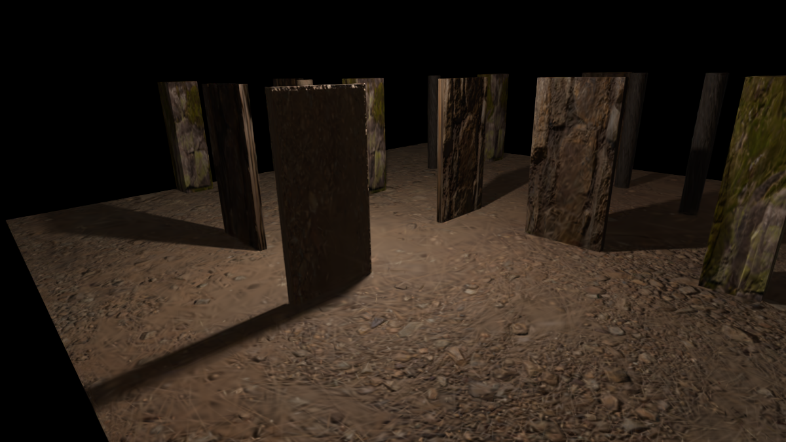

# Vivarium
Training environment for mobile robots

<p align="center">
  
</p>


## Setup  
```
pip3 install pip --upgrade  
python3.10 -m venv --system-site-packages ./venv  
source ./venv/bin/activate  
pip install pip --upgrade  
pip install -r requirements.txt  
```

## Creating an artificial Gaussian Splat  
Create random camera poses using:
```
scripts/generate_camera_poses_csv.py
```
Inside Blender, scripting run the following rendering script:
```
scripts/blender_render_camera_poses.py
```
To conver the camera_poses.csv to colmap format, run:

```
The script needs:
+── path to scene
│   +── images
│   +── camera_poses.csv
│   +── cameras.txt
    
colmap feature_extractor --database_path database.db --image_path images --ImageReader.camera_model PINHOLE
colmap exhaustive_matcher --database_path database.db --ExhaustiveMatching.block_size 300
Run sparse_from_known_poses.py
colmap point_triangulator --database_path database.db --image_path images --input_path sparse/0 --output_path sparse/0
```
Notes: Remember to have the right images size rendered in Blender.

## Other