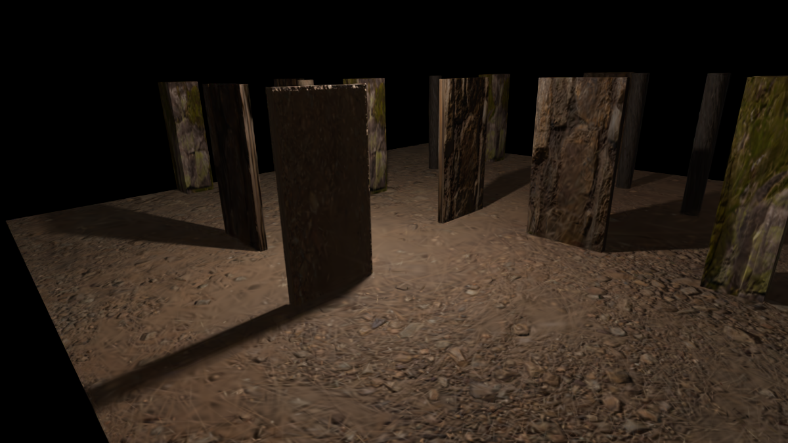

# Vivarium
Vivarium is a feasibility study on using Gaussian Splat to train camera mobile robots in a reinforcement learning
environment. To simplify the process, the prototype Gaussian Splat was created using an artificial scene made in
Blender. The advantage of this is that the Blender mesh and resulting Gaussian splat are in the same coordinate system.
Colmap was used find the initial feature points used to seed the splat. 

<p align="center">
  
</p>


## Setup  
```
pip3 install pip --upgrade  
python3.10 -m venv --system-site-packages ./venv  
source ./venv/bin/activate  
pip install pip --upgrade  
pip install -r requirements.txt  
```

## Creating an artificial Gaussian Splat  
Create random camera poses using:
```
scripts/generate_camera_poses_csv.py
```
Inside Blender, scripting run the following rendering script:
```
scripts/blender_render_camera_poses.py
```
To conver the camera_poses.csv to colmap format, run:

```
The script needs:
+── path to scene_0
│   +── images
│   +── camera_poses.csv
│   +── cameras.txt
    
colmap feature_extractor --database_path database.db --image_path images --ImageReader.camera_model PINHOLE
colmap exhaustive_matcher --database_path database.db --ExhaustiveMatching.block_size 300
# Run sparse_from_known_poses.py
colmap point_triangulator --database_path database.db --image_path images --input_path sparse/0 --output_path sparse/0
# Move camera_poses.csv and cameras.txt to sparse/0
# Run the the Gaussian Splatting training and create the .ply scene
(gaussian-splatting) python .../gaussian-splatting/train.py -s scene_0/sparse/0
# View the resulting gaussian splat
(gaussian-splatting) ./SIBR_viewers/install/bin/SIBR_gaussianViewer_app --model-path gaussian-splatting/output/XXXXXXXX-X
```
Notes: Remember to have the right images size rendered in Blender.

To stitch output .png images together use:
```
ffmpeg -framerate 30 -pattern_type glob -i "*.png" -c:v libx264 -pix_fmt yuv420p output.mp4
```

## Other
Coming soon...